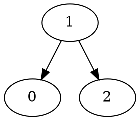
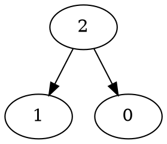
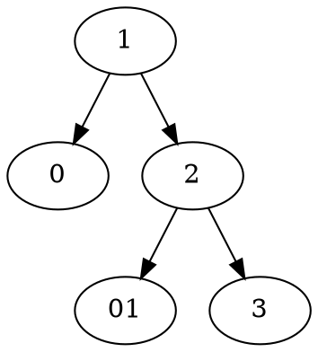
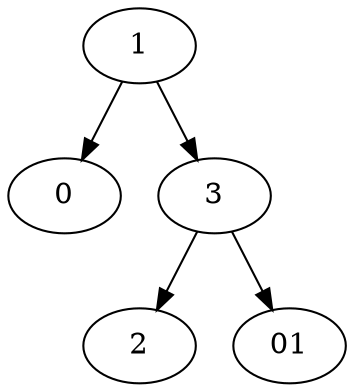
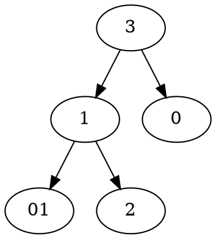
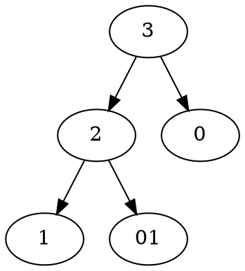

# Problem Definition

## Description

Given a number ‘n’, write a function to return all structurally unique Binary Search Trees (BST) that can store values 1 to ‘n’?

Note: In the diagrams below, ignore the `0` node and all connectons to it.

Example 1:

```plaintext
Input: 2
Output: 2
Explanation: Here are all the structurally unique BSTs storing all numbers from 1 to 2:
```





Example 2:

```plaintext
Input: 3
Output: 5
Explanation: Here are all the structurally unique BSTs storing all numbers from 1 to 3:
```










## Discussion

This problem follows the **Subsets** pattern and is quite similar to **Evaluate Expression**. Following a similar approach, we can iterate from 1 to ‘n’ and consider each number as the root of a tree. All smaller numbers will make up the left sub-tree and bigger numbers will make up the right sub-tree. We will make recursive calls for the left and right sub-trees

### Time Complexity

The time complexity of this algorithm will be exponential and will be similar to **Balanced Parentheses**. Estimated time complexity will be O(n*2^n) but the actual time complexity ( O(4^n/\sqrt{n}) is bounded by the [Catalan number](https://en.wikipedia.org/wiki/Catalan_number) and is beyond the scope of a coding interview. More details [here](https://en.wikipedia.org/wiki/Central_binomial_coefficient).

### Space Complexity

The space complexity of this algorithm will be exponential too, estimated at O(2^n), but the actual will be ( O(4^n/\sqrt{n}).

### Memoized version

Since our algorithm has overlapping sub-problems, can we use memoization to improve it? We could, but every time we return the result of a subproblem from the cache, we have to clone the result list because these trees will be used as the left or right child of a tree. This cloning is equivalent to reconstructing the trees, therefore, the overall time complexity of the memoized algorithm will also be the same.

## Notes

## References
