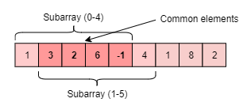
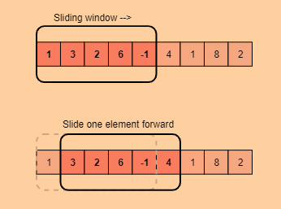

# Introduction

In many problems dealing with an array (or a LinkedList), we are asked to find or calculate something among all the subarrays (or sublists) of a given size. For example, take a look at this problem:

`Given an array, find the average of all subarrays of size ‘K’ in it.`

Let’s understand this problem with a real input:

`Array: [1, 3, 2, 6, -1, 4, 1, 8, 2], K=5`

Here, we are asked to find the average of all subarrays of size ‘5’ in the given array. Let’s solve this:

1. For the first 5 numbers (subarray from index 0-4), the average is: (1+3+2+6-1)/5 => 2.2.
2. The average of next 5 numbers (subarray from index 1-5) is: (3+2+6-1+4)/5 => 2.8.
3. For the next 5 numbers (subarray from index 2-6), the average is: (2+6-1+4+1)/5 => 2.4
4. …

Here is the final output containing the averages of all subarrays of size 5:

`Output: [2.2, 2.8, 2.4, 3.6, 2.8]`

A brute-force algorithm will be to calculate the sum of every 5-element subarray of the given array and divide the sum by ‘5’ to find the average. This is what the algorithm will look like:

```java
import java.util.Arrays;

class AverageOfSubarrayOfSizeK {
  public static double[] findAverages(int K, int[] arr) {
    double[] result = new double[arr.length - K + 1];
    for (int i = 0; i <= arr.length - K; i++) {
      // find sum of next 'K' elements
      double sum = 0;
      for (int j = i; j < i + K; j++)
        sum += arr[j];
      result[i] = sum / K; // calculate average
    }

    return result;
  }

  public static void main(String[] args) {
    double[] result = AverageOfSubarrayOfSizeK.findAverages(5, new int[] { 1, 3, 2, 6, -1, 4, 1, 8, 2 });
    System.out.println("Averages of subarrays of size K: " + Arrays.toString(result));
  }
}
```

**Time complexity:** Since for every element of the input array, we are calculating the sum of its next `K` elements, the time complexity of the above algorithm will be `O(N*K)` where `N` is the number of elements in the input array.

Can we find a better solution? Do you see any inefficiency in the above approach?

The inefficiency is that for any two consecutive subarrays of size `5`, the overlapping part (which will contain four elements) will be evaluated twice. For example, take the above-mentioned input:



As you can see, there are four overlapping elements between the subarray (indexed from 0-4) and the subarray (indexed from 1-5). Can we somehow reuse the `sum` we have calculated for the overlapping elements?

The efficient way to solve this problem would be to visualize each subarray as a sliding window of `5` elements. This means that when we move on to the next subarray, we will slide the window by one element. So, to reuse the `sum` from the previous subarray, we will subtract the element going out of the window and add the element now being included in the sliding window. This will save us from going through the whole subarray to find the `sum` and, as a result, the algorithm complexity will reduce to `O(N)`.



Here is the algorithm for the **Sliding Window** approach:

```java
import java.util.Arrays;

class AverageOfSubarrayOfSizeK {
  public static double[] findAverages(int K, int[] arr) {
    double[] result = new double[arr.length - K + 1];
    double windowSum = 0;
    int windowStart = 0;
    for (int windowEnd = 0; windowEnd < arr.length; windowEnd++) {
      windowSum += arr[windowEnd]; // add the next element
      // slide the window, we don't need to slide if we've not hit the required window size of 'k'
      if (windowEnd >= K - 1) {
        result[windowStart] = windowSum / K; // calculate the average
        windowSum -= arr[windowStart]; // subtract the element going out
        windowStart++; // slide the window ahead
      }
    }

    return result;
  }

  public static void main(String[] args) {
    double[] result = AverageOfSubarrayOfSizeK.findAverages(5, new int[] { 1, 3, 2, 6, -1, 4, 1, 8, 2 });
    System.out.println("Averages of subarrays of size K: " + Arrays.toString(result));
  }
}
```

In the following chapters, we will apply the **Sliding Window** approach to solve a few problems.

In some problems, the size of the sliding window is not fixed. We have to expand or shrink the window based on the problem constraints. We will see a few examples of such problems in the next chapters.

Let’s jump onto our first problem and apply the **Sliding Window** pattern.
