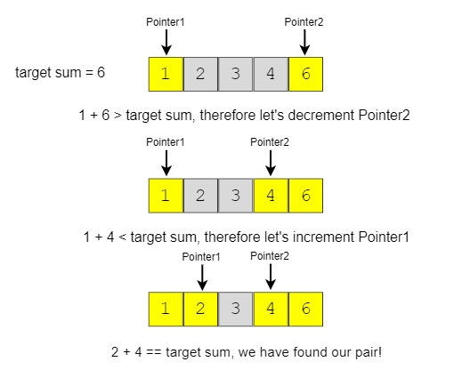

# Introduction

In problems where we deal with sorted arrays (or LinkedLists) and need to find a set of elements that fulfill certain constraints, the Two Pointers approach becomes quite useful. The set of elements could be a pair, a triplet or even a subarray.

Let us consider this problem:

> Given an array of sorted numbers and a target sum, find a pair in the array whose sum is equal to the given target.

**Naive Approach:** We can consider each element one by one (pointed out by the first pointer) and iterate through the remaining elements (pointed out by the second pointer) to find a pair with the given sum. The time complexity of this algorithm will be O(N^2) where ‘N’ is the number of elements in the input array.

**Optimized Approach:** Given that the input array is sorted, an efficient way would be to start with one pointer in the beginning and another pointer at the end. At every step, we will see if the numbers pointed by the two pointers add up to the target sum. If they do not, we will do one of two things:

1. If the sum of the two numbers pointed by the two pointers is greater than the target sum, this means that we need a pair with a smaller sum. So, to try more pairs, we can decrement the end-pointer.
2. If the sum of the two numbers pointed by the two pointers is smaller than the target sum, this means that we need a pair with a larger sum. So, to try more pairs, we can increment the start-pointer.

The time complexity of the above algorithm will be O(N).
