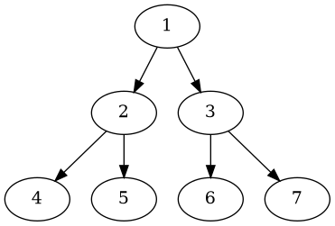
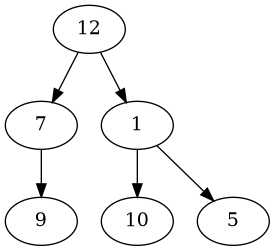

# Problem Definition

## Description

Given a binary tree, populate an array to represent its level-by-level traversal in reverse order, i.e., the **lowest level comes first**. You should populate the values of all nodes in each level from left to right in separate sub-arrays.

Example 1:



```plaintext
Level Order Traversal:  
    [[4,5,6,7],
    [2,3],
    [1]]  
```

Example 2:



```plaintext
Level Order Traversal:  
    [[9,10,5],
    [7,1],
    [12]]
```

## Discussion

This problem follows the **Binary Tree Level Order Traversal** pattern. We can follow the same **BFS** approach. The only difference will be that instead of appending the current level at the end, we will append the current level at the beginning of the result list.

**Note about code:** For Java, we will use a `LinkedList` instead of an `ArrayList` for our result list. As in the case of `ArrayList`, appending an element at the beginning means shifting all the existing elements. Since we need to append the level array at the beginning of the result list, a `LinkedList` will be better, as this shifting of elements is not required in a `LinkedList`. Similarly, we will use a double-ended queue (deque) for **Python**, **C++**, and **JavaScript**.

### Time Complexity

The time complexity of the above algorithm is O(N), where ‘N’ is the total number of nodes in the tree. This is due to the fact that we traverse each node once.

### Space Complexity

The space complexity of the above algorithm will be O(N) as we need to return a list containing the level order traversal. We will also need O(N) space for the queue. Since we can have a maximum of N/2 nodes at any level (this could happen only at the lowest level), therefore we will need O(N) space to store them in the queue.

## Notes

## References
