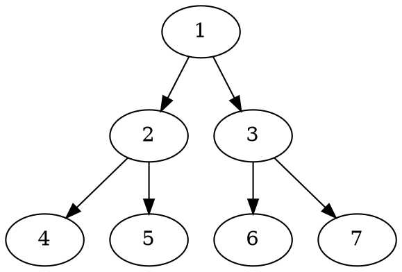
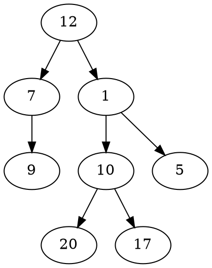

# Problem Definition

## Description

Given a binary tree, populate an array to represent its zigzag level order traversal. You should populate the values of all **nodes of the first level from left to right**, then **right to left for the next level** and keep alternating in the same manner for the following levels.

Example 1:



```plaintext
Level Order Traversal:  
    [[1],
    [3,2],
    [4,5,6,7]]  
```

Example 2:



```plaintext
Level Order Traversal:  
    [[12],
    [1,7],
    [9,10,5]
    [17,20]]  
```

## Discussion

This problem follows the **Binary Tree Level Order Traversal** pattern. We can follow the same BFS approach. The only additional step we have to keep in mind is to alternate the level order traversal, which means that for every other level, we will traverse similar to **Reverse Level Order Traversal**.

### Time Complexity

The time complexity of the above algorithm is O(N), where ‘N’ is the total number of nodes in the tree. This is due to the fact that we traverse each node once.

### Space Complexity

The space complexity of the above algorithm will be O(N) as we need to return a list containing the level order traversal. We will also need O(N) space for the queue. Since we can have a maximum of N/2 nodes at any level (this could happen only at the lowest level), therefore we will need O(N) space to store them in the queue.

## Notes

## References
