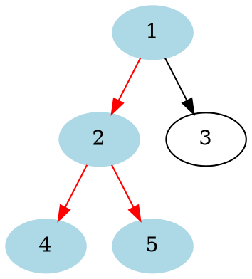
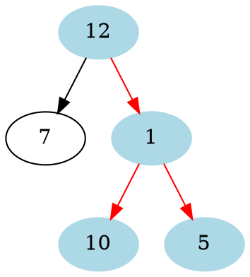
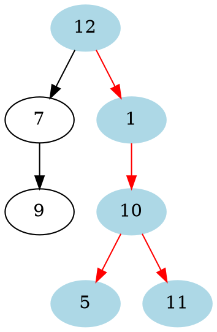

# Problem Definition

## Description

Given a binary tree, find its maximum depth (or height).

Example 1:



```plaintext
Maximum Depth: 3
```

Example 2:



```plaintext
Maximum Depth: 3
```

Example 3:



```plaintext
Maximum Depth: 4
```

## Discussion

We will follow a similar approach. Instead of returning as soon as we find a leaf node, we will keep traversing for all the levels, incrementing `maximumDepth` each time we complete a level.

### Time Complexity

The time complexity of the above algorithm is O(N), where ‘N’ is the total number of nodes in the tree. This is due to the fact that we traverse each node once.

### Space Complexity

The space complexity of the above algorithm will be O(N) which is required for the queue. Since we can have a maximum of N/2 nodes at any level (this could happen only at the lowest level), therefore we will need O(N) space to store them in the queue.

## Notes

## References
