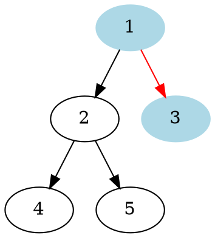
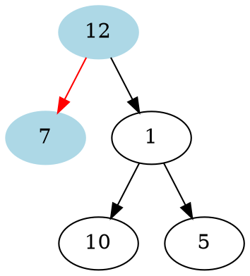
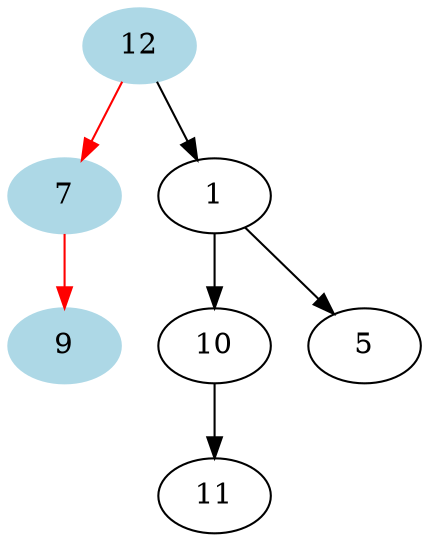

# Problem Definition

## Description

Find the minimum depth of a binary tree. The minimum depth is the number of nodes along the **shortest path from the root node to the nearest leaf node**.

Example 1:



```plaintext
Minimum Depth: 2
```

Example 2:



```plaintext
Minimum Depth: 2
```

Example 3:



```plaintext
Minimum Depth: 3
```

## Discussion

This problem follows the **Binary Tree Level Order Traversal** pattern. We can follow the same BFS approach. The only difference will be, instead of keeping track of all the nodes in a level, we will only track the depth of the tree. As soon as we find our first leaf node, that level will represent the minimum depth of the tree.

### Time Complexity

The time complexity of the above algorithm is O(N), where ‘N’ is the total number of nodes in the tree. This is due to the fact that we traverse each node once.

### Space Complexity

The space complexity of the above algorithm will be O(N) which is required for the queue. Since we can have a maximum of N/2 nodes at any level (this could happen only at the lowest level), therefore we will need O(N) space to store them in the queue.

## Notes

## References
