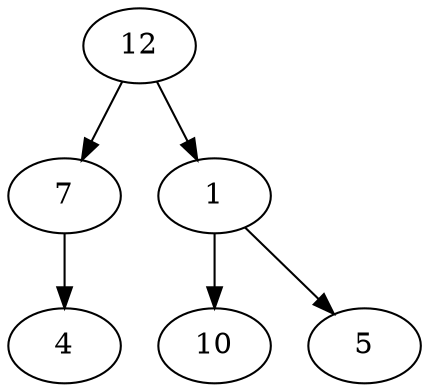

# Problem Definition

## Description

Given a binary tree, find the root-to-leaf path with the maximum sum.



```plaintext
12, 7, 4
12, 1, 10
```

## Discussion

We can follow a similar approach as in the **All Paths for a Sum** problem. As we traverse all paths, we can keep track of the path with the maximum sum.

### Time Complexity

### Space Complexity

## Notes

## References

1. [Geeks for Geeks - Find the maximum sum leaf to root path in a Binary Tree](https://www.geeksforgeeks.org/find-the-maximum-sum-path-in-a-binary-tree/)
2. [Given a binary tree, find out the maximum sum of value from root to each leaf](https://algorithms.tutorialhorizon.com/given-a-binary-tree-find-out-the-maximum-sum-of-value-from-root-to-each-leaf/)
