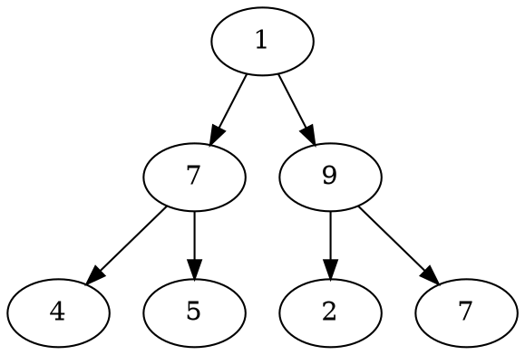
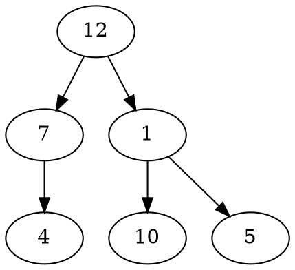
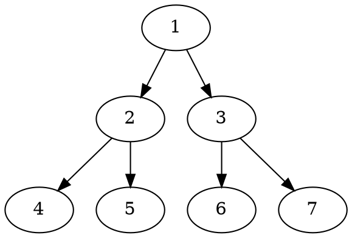

# Problem Definition

## Description

Given a binary tree and a number ‘S’, find all paths from root-to-leaf such that the sum of all the node values of each path equals ‘S’.

Example 1:



```plaintext
S: 12
Output: 2
Explanation: There are the two paths with sum '12':
    1 -> 7 -> 4 and 1 -> 9 -> 2
```

Example 2:



```plaintext
S: 23
Output: 2
Explanation: Here are the two paths with sum '23':
    12 -> 7 -> 4 and 12 -> 1 -> 10
```

## Discussion

This problem follows the **Binary Tree Path Sum** pattern. We can follow the same DFS approach. There will be two differences:

1. Every time we find a root-to-leaf path, we will store it in a list.
2. We will traverse all paths and will not stop processing after finding the first path.

### Time Complexity

The time complexity of the above algorithm is O(N^2), where ‘N’ is the total number of nodes in the tree. This is due to the fact that we traverse each node once (which will take O(N)), and for every leaf node we might have to store its path which will take O(N).

We can calculate a tighter time complexity of O(NlogN) from the space complexity discussion below.

### Space Complexity

If we ignore the space required for the `allPaths` list, the space complexity of the above algorithm will be O(N) in the worst case. This space will be used to store the recursion stack. The worst case will happen when the given tree is a linked list (i.e., every node has only one child).

How can we estimate the space used for the `allPaths` array? Take the example of the following balanced tree:



Here we have seven nodes (i.e., `N = 7`). Since, for binary trees, there exists only one path to reach any leaf node, we can easily say that total root-to-leaf paths in a binary tree can’t be more than the number of leaves. As we know that there can’t be more than N/2 leaves in a binary tree, therefore the maximum number of elements in `allPaths` will be O(N/2) = O(N). Now, each of these paths can have many nodes in them. For a balanced binary tree (like above), each leaf node will be at maximum depth. As we know that the depth (or height) of a balanced binary tree is O(logN) we can say that, at the most, each path can have logN nodes in it. This means that the total size of the allPaths list will be O(N*logN). If the tree is not balanced, we will still have the same worst-case space complexity.

From the above discussion, we can conclude that the overall space complexity of our algorithm is O(N*logN).

Also from the above discussion, since for each leaf node, in the worst case, we have to copy log(N) nodes to store its path, therefore the time complexity of our algorithm will also be O(N*logN).

## Notes

## References
