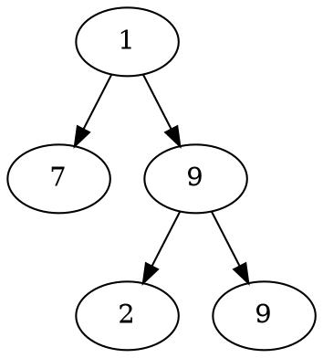
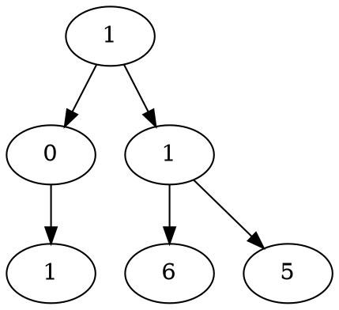

# Problem Definition

## Description

Given a binary tree where each node can only have a digit (0-9) value, each root-to-leaf path will represent a number. Find the total sum of all the numbers represented by all paths.

Example 1:



```plaintext
Output: 408
Explanation: The sum of all path numbers: 17 + 192 + 199
```

Example 2:



```plaintext
Output: 332
Explanation: The sum of all path numbers: 101 + 116 + 115
```

## Discussion

This problem follows the **Binary Tree Path Sum** pattern. We can follow the same **DFS** approach. The additional thing we need to do is to keep track of the number representing the current path.

How do we calculate the path number for a node? Taking the first example mentioned above, say we are at node ‘7’. As we know, the path number for this node is ‘17’, which was calculated by: `1 * 10 + 7 => 17`. We will follow the same approach to calculate the path number of each node.

### Time Complexity

The time complexity of the above algorithm is O(N), where ‘N’ is the total number of nodes in the tree. This is due to the fact that we traverse each node once.

### Space Complexity

The space complexity of the above algorithm will be O(N) in the worst case. This space will be used to store the recursion stack. The worst case will happen when the given tree is a linked list (i.e., every node has only one child).

## Notes

## References
