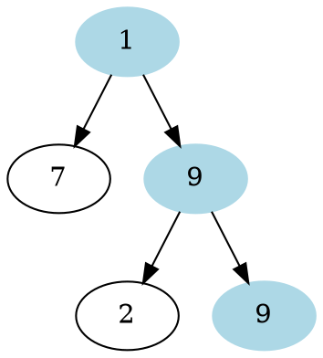
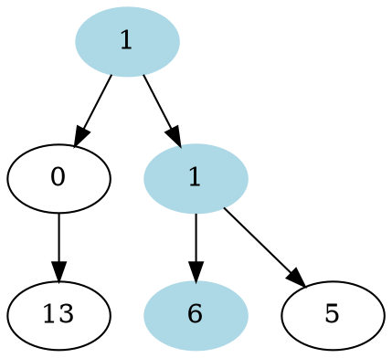

# Problem Definition

## Description

Given a binary tree and a number sequence, find if the sequence is present as a root-to-leaf path in the given tree.

Example 1:



```plaintext
Sequence: [1, 9, 9]
Output: true
Explanation: The tree has a path 1 -> 9 -> 9.
```

Example 2:



```plaintext
Sequence: [1, 0, 7]
Output: false
Explanation: The tree does not have a path 1 -> 0 -> 7.

Sequence: [1, 1, 6]
Output: true
Explanation: The tree has a path 1 -> 1 -> 6.
```

## Discussion

This problem follows the **Binary Tree Path Sum** pattern. We can follow the same **DFS** approach and additionally, track the element of the given sequence that we should match with the current node. Also, we can return `false` as soon as we find a mismatch between the sequence and the node value.

### Time Complexity

The time complexity of the above algorithm is O(N), where ‘N’ is the total number of nodes in the tree. This is due to the fact that we traverse each node once.

### Space Complexity

The space complexity of the above algorithm will be O(N) in the worst case. This space will be used to store the recursion stack. The worst case will happen when the given tree is a linked list (i.e., every node has only one child).

## Notes

## References
