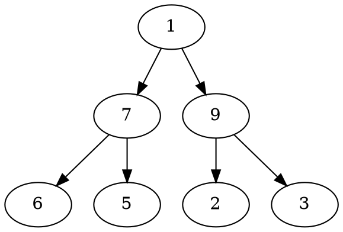
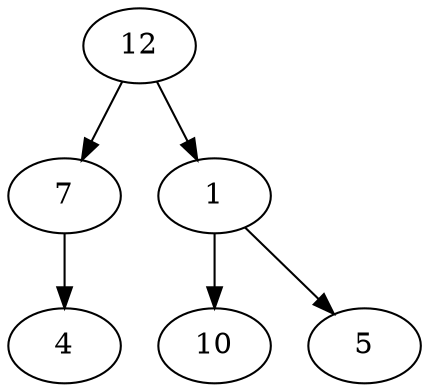

# Problem Definition

## Description

Given a binary tree and a number ‘S’, find all paths in the tree such that the sum of all the node values of each path equals ‘S’. Please note that the paths can start or end at any node but all paths must follow direction from parent to child (top to bottom).

Example 1:



```plaintext
S: 12
Output: 3
Explanation: There are three paths with sum '12':
    7 -> 5, 1 -> 9 -> 2, and 9 -> 3
```

Example 2:



```plaintext
S: 11
Output: 2
Explanation: Here are the two paths with sum '11':
    7 -> 4 . and 1 -> 10.
```

## Discussion

This problem follows the **Binary Tree Path Sum** pattern. We can follow the same **DFS** approach. But there will be four differences:

1. We will keep track of the current path in a list which will be passed to every recursive call.
2. Whenever we traverse a node we will do two things:
   1. Add the current node to the current path.
   2. As we added a new node to the current path, we should find the sums of all sub-paths ending at the current node. If the sum of any sub-path is equal to ‘S’ we will increment our path count.
3. We will traverse all paths and will not stop processing after finding the first path.
4. Remove the current node from the current path before returning from the function. This is needed to Backtrack while we are going up the recursive call stack to process other paths.

### Time Complexity

The time complexity of the above algorithm is O(N^2) in the worst case, where ‘N’ is the total number of nodes in the tree. This is due to the fact that we traverse each node once, but for every node, we iterate the current path. The current path, in the worst case, can be O(N) (in the case of a skewed tree). But, if the tree is balanced, then the current path will be equal to the height of the tree, i.e., O(logN). So the best case of our algorithm will be O(NlogN).

### Space Complexity

The space complexity of the above algorithm will be O(N). This space will be used to store the recursion stack. The worst case will happen when the given tree is a linked list (i.e., every node has only one child). We also need O(N) space for storing the `currentPath` in the worst case.

Overall space complexity of our algorithm is O(N).

## Notes

## References
