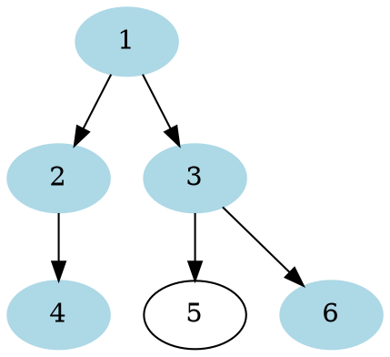
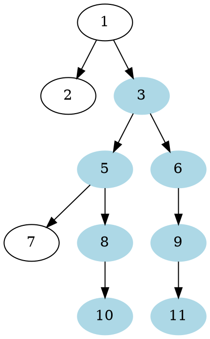

# Problem Definition

## Description

Given a binary tree, find the length of its diameter. The diameter of a tree is the number of nodes on the **longest path between any two leaf nodes**. The diameter of a tree may or may not pass through the root.

Example 1:



```plaintext
Output: 5
Explanation: The diameter of the tree is: [4, 2, 1, 3, 6]
```

Example 2:



```plaintext
Output: 7
Explanation: The diameter of the tree is: [10, 8, 5, 3, 6, 9, 11]
```

## Discussion

This problem follows the **Binary Tree Path Sum** pattern. We can follow the same **DFS** approach. There will be a few differences:

1. At every step, we need to find the height of both children of the current node. For this, we will make two recursive calls similar to **DFS**.
2. The height of the current node will be equal to the maximum of the heights of its left or right children, plus ‘1’ for the current node.
3. The tree diameter at the current node will be equal to the height of the left child plus the height of the right child plus ‘1’ for the current node: `diameter = leftTreeHeight + rightTreeHeight + 1`. To find the overall tree diameter, we will use a class level variable. This variable will store the maximum diameter of all the nodes visited so far, hence, eventually, it will have the final tree diameter.

### Time Complexity

The time complexity of the above algorithm is O(N), where ‘N’ is the total number of nodes in the tree. This is due to the fact that we traverse each node once.

### Space Complexity

The space complexity of the above algorithm will be O(N) in the worst case. This space will be used to store the recursion stack. The worst case will happen when the given tree is a linked list (i.e., every node has only one child).

## Notes

## References
