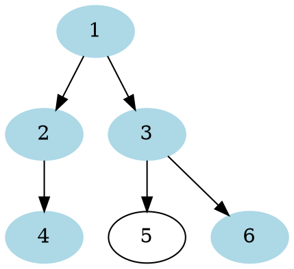
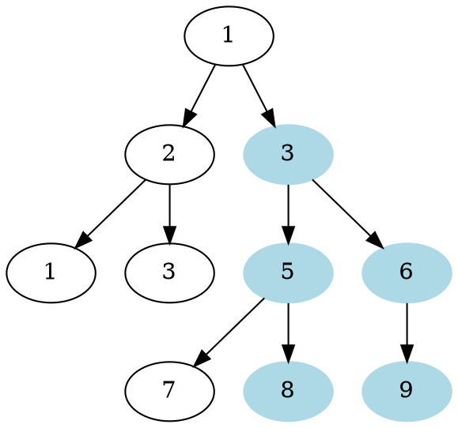

# Problem Definition

## Description

Find the path with the maximum sum in a given binary tree. Write a function that returns the maximum sum. A path can be defined as a **sequence of nodes between any two leaf nodes** and doesn’t necessarily pass through the root.

Example 1:



```plaintext
Output: 16
Explanation: The path with maximum sum is: [4, 2, 1, 3, 6]
```

Example 2:



```plaintext
Output: 31
Explanation: The path with maximum sum is: [8, 5, 3, 6, 9]
```

## Discussion

This problem follows the **Binary Tree Path Sum** pattern and shares the algorithmic logic with **Tree Diameter**. We can follow the same **DFS** approach. The only difference will be to ignore the paths with negative sums. Since we need to find the overall maximum sum, we should ignore any path which has an overall negative sum.

### Time Complexity

The time complexity of the above algorithm is O(N), where ‘N’ is the total number of nodes in the tree. This is due to the fact that we traverse each node once.

### Space Complexity

The space complexity of the above algorithm will be O(N) in the worst case. This space will be used to store the recursion stack. The worst case will happen when the given tree is a linked list (i.e., every node has only one child).

## Notes

## References
