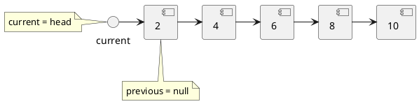
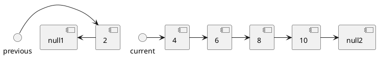
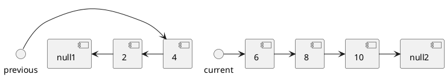
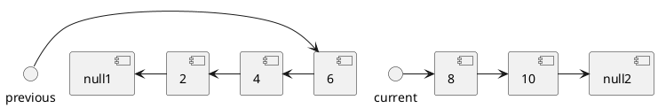
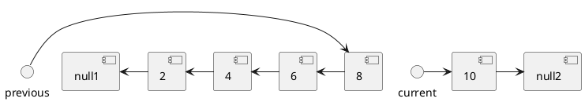
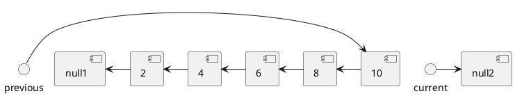
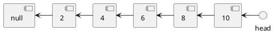

# Problem Definition

## Description

Given the head of a Singly LinkedList, reverse the LinkedList. Write a function to return the new head of the reversed LinkedList.

## Notes

To reverse a LinkedList, we need to reverse one node at a time. We will start with a variable `current` which will initially point to the head of the LinkedList and a variable `previous` which will point to the previous node that we have processed; initially `previous` will point to `null`.

In a stepwise manner, we will reverse the current node by pointing it to the `previous` before moving on to the next node. Also, we will update the `previous` to always point to the `previous` node that we have processed. The visual representation o the algorithm is as shown below.

### Time Complexity

The time complexity of our algorithm will be O(N) where ‘N’ is the total number of nodes in the LinkedList.

### Space Complexity

We only used constant space, therefore, the space complexity of our algorithm is O(1).

## References
