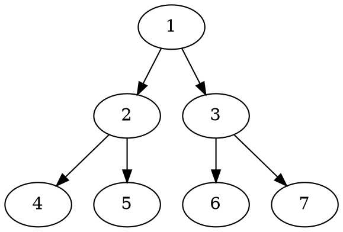
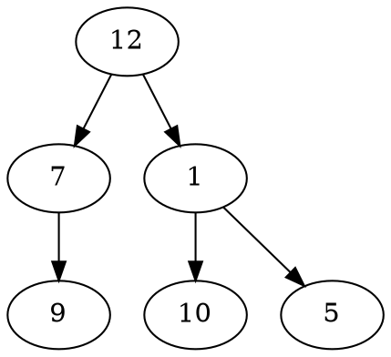
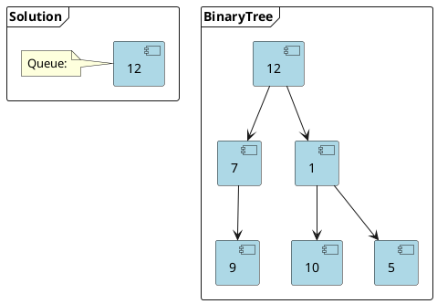
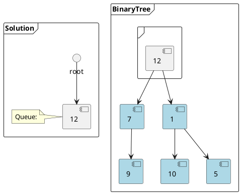
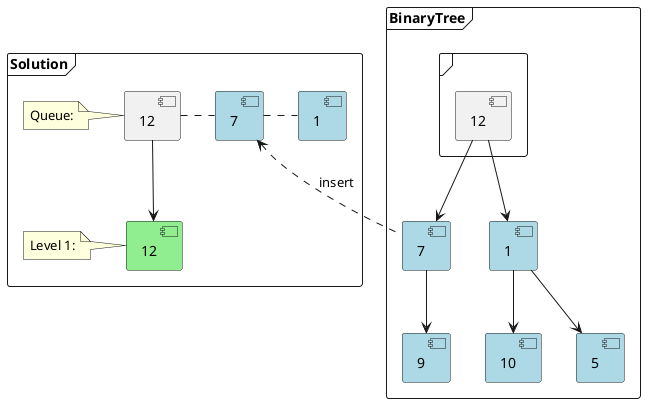
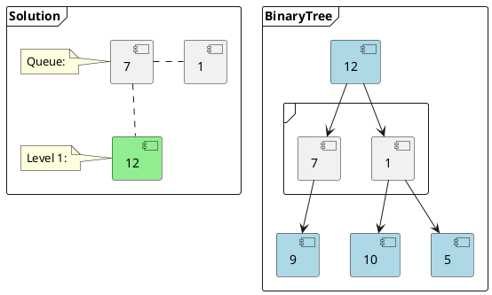
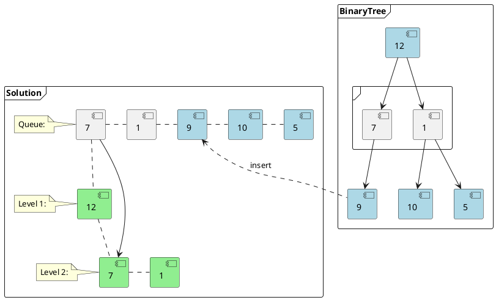
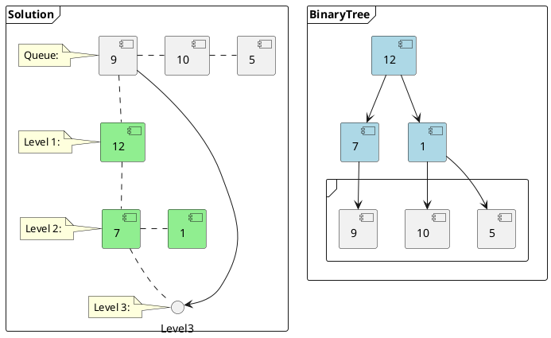

# Problem Definition

## Description

Given a binary tree, populate an array to represent its level-by-level traversal. You should populate the values of all **nodes of each level from left to right** in separate sub-arrays.

Example 1:



```text
Level Order Traversal:  
    [[1],
    [2,3],
    [4,5,6,7]]  
```

Example 2:



```text
Level Order Traversal:  
    [[12],
    [7,1],
    [9,10,5]]
```

## Discussion

Since we need to traverse all nodes of each level before moving onto the next level, we can use the **Breadth First Search (BFS)** technique to solve this problem.

We can use a Queue to efficiently traverse in BFS fashion. Here are the steps of our algorithm:

1. Start by pushing the `root` node to the queue.
2. Keep iterating until the queue is empty.
3. In each iteration, first count the elements in the queue (let’s call it `levelSize`). We will have these many nodes in the current level.
4. Next, remove `levelSize` nodes from the queue and push their `value` in an array to represent the current level.
5. After removing each node from the queue, insert both of its children into the queue.
6. If the queue is not empty, repeat from step 3 for the next level.

Here is the visual representation of this algorithm using the Example 2 from above.



```text
1 of 7.
Level Size: 1
Start by pushing the root to the queue.
```



```text
2 of 7.
Level Size: 1
Count the elements of the queue (levelSize = 1), they all will
be in the first level. Since the levelSize is "1" there will be
one element in the first level.
```



```text
3 of 7.
Level Size: 1
Move "one" element to the the output array representing the first level
and push its children to the queue.
```



```text
4 of 7.
Level Size: 2
Count the elements of the queue (levelSize = 2), they all will be
in the second level. Since the levelSize is "2" there will be two
elements in the second level.
```



```text
5 of 7.
Level Size: 2
Move "two" elements to the the output array representing the
second level and push their children to the queue in the same order.
```



```text
6 of 7.
Level Size: 3
Count the elements of the queue (levelSize = 3), they all will be in the third level.
Since the levelSize is "3" there will be three elements in the third level.
```

```plantuml
@startuml
frame "Solution" {
    note left of () Queue
    Queue:
    end note
    component 12_2 #lightgreen [
        12
    ]
    component 7_2 #lightgreen [
        7
    ]
    component 1_2 #lightgreen [
        1
    ]
    component 9_2 #lightgreen [
        9
    ]
    component 10_2 #lightgreen [
        10
    ]
    component 5_2 #lightgreen [
        5
    ]
    note left of 12_2
    Level 1:
    end note

    7_2 . 1_2

    9_2 . 10_2
    10_2 . 5_2

    () Queue .. 12_2
    12_2 .. 7_2
    7_2 .. 9_2

    note left of 7_2
    Level 2:
    end note

    note left of 9_2
    Level 3:
    end note
}

frame "BinaryTree" {
    [12] --> [7]
    [12] --> [1]

    frame " " {
        component [9]
        component [10]
        component [5]
    }

    [7] --> [9]
    [1] --> [10]
    [1] --> [5]

    component [12] #lightblue
    component [7] #lightblue
    component [1] #lightblue
}
@enduml
```

```text
7 of 7.
Level Size: 3
Move "three" elements to the the output array representing third level.
```

### Time Complexity

### Space Complexity

## Notes

## References
