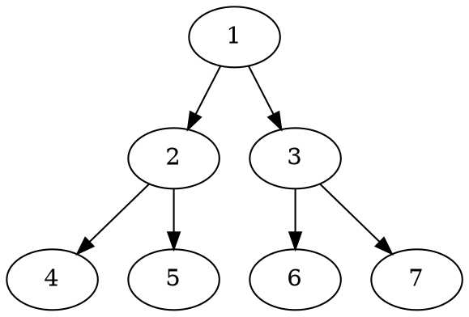
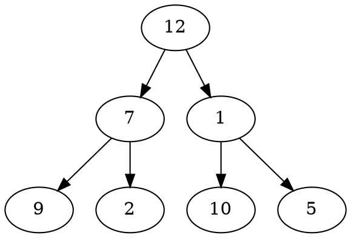

# Problem Definition

## Description

Given a binary tree, find the largest value on each level.

Example 1:



```plaintext
Largest value on each level: [1, 3, 7]
```

Example 2:



```plaintext
Level Order Traversal: [12, 7, 10]
```

## Discussion

This problem follows the **Binary Tree Level Order Traversal** pattern. We can follow the same **BFS** approach. The only difference will be that instead of keeping track of all nodes of a level, we will only track the maximum value of each level. In the end, we will append the maximum value at the current level to the result array.

```java
maxValue = max(maxValue, currentNode.val)
```

### Time Complexity

The time complexity of the above algorithm is O(N), where ‘N’ is the total number of nodes in the tree. This is due to the fact that we traverse each node once.

### Space Complexity

The space complexity of the above algorithm will be O(N) which is required for the queue. Since we can have a maximum of N/2 nodes at any level (this could happen only at the lowest level), therefore we will need O(N) space to store them in the queue.

## Notes

## References
