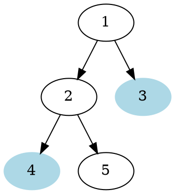
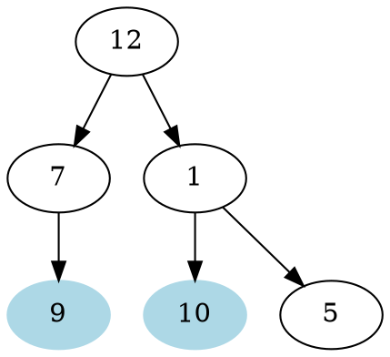
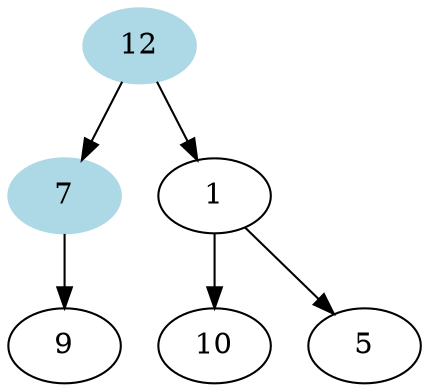

# Problem Definition

## Description

Given a binary tree and a node, find the level order successor of the given node in the tree. The level order successor is the node that appears right after the given node in the level order traversal.

Example 1:



```plaintext
Given Node: 3
Level Order Successor: 4
```

Example 2:



```plaintext
Given Node: 9
Level Order Successor: 10
```

Example 3:



```plaintext
Given Node: 12
Level Order Successor: 7
```

## Discussion

This problem follows the **Binary Tree Level Order Traversal** pattern. We can follow the same **BFS** approach. The only difference will be that we will not keep track of all the levels. Instead we will keep inserting child nodes to the queue. As soon as we find the given node, we will return the next node from the queue as the level order successor.

### Time Complexity

The time complexity of the above algorithm is O(N), where ‘N’ is the total number of nodes in the tree. This is due to the fact that we traverse each node once.

### Space Complexity

The space complexity of the above algorithm will be O(N) which is required for the queue. Since we can have a maximum of N/2 nodes at any level (this could happen only at the lowest level), therefore we will need O(N) space to store them in the queue.

## Notes

## References
