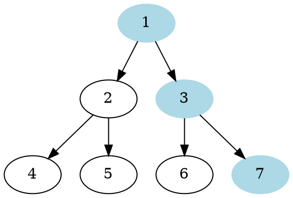
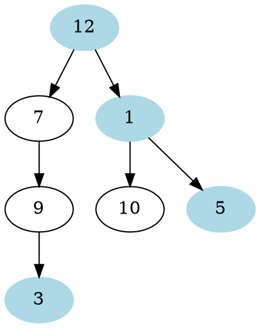

# Problem Definition

## Description

Given a binary tree, return an array containing nodes in its right view. The right view of a binary tree is the set of **nodes visible when the tree is seen from the right side**.

## Discussion

Example 1:



```plaintext
Right View: [1, 3, 7]
```

Example 2:



```plaintext
Right View: [12, 1, 5, 3]
```

### Time Complexity

The time complexity of the above algorithm is O(N), where ‘N’ is the total number of nodes in the tree. This is due to the fact that we traverse each node once.

### Space Complexity

The space complexity of the above algorithm will be O(N) as we need to return a list containing the level order traversal. We will also need O(N) space for the queue. Since we can have a maximum of N/2 nodes at any level (this could happen only at the lowest level), therefore we will need O(N) space to store them in the queue.

## Notes

## References
