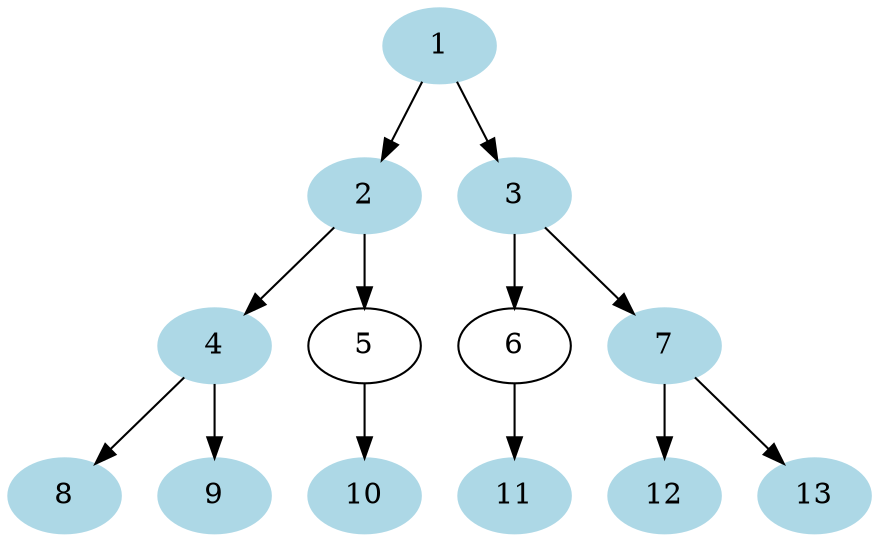
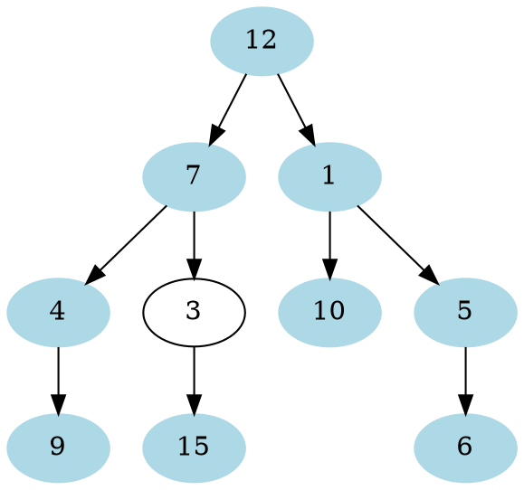
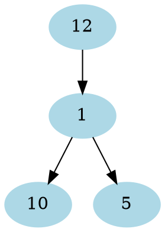

# Problem Definition

## Description

Given a binary tree, return an array containing all the **boundary nodes of the tree in an anti-clockwise direction**.

The boundary of a tree contains all nodes in the left view, all leaves, and all nodes in the right view. Please note that there should not be any duplicate nodes. For example, the root is only included in the left view; similarly, if a level has only one node we should include it in the left view.

Example 1:



```plaintext
Tree boundary: [1, 2, 4, 8, 9, 10, 11, 12,13, 7, 3]
```

Example 2:



```plaintext
Tree boundary: [12, 7, 4, 9, 15, 10, 6, 5, 1]
```

Example 3:



```plaintext
Tree boundary: [12, 1, 10, 5]
Please note that whenever we've only one node on a level, we include it in the left view.
```

## Discussion

This problem follows the **Binary Tree Level Order Traversal** pattern and shares algorithmic logic with **Right View of a Binary Tree**. We can follow the same **BFS** approach. While traversing different levels, we will populate three arrays:

1. **Tree Left View** - contains the first node of each level
2. **Leaves** - contains all leaf nodes.
3. **Tree Right View** - contains the last node of each level

Finally, we will merge these three arrays to calculate the tree boundary.

To find the leaves in the left to right order we can’t use **BFS** because any leaf node coming in a higher level will not necessarily come before a leaf on the lower level. To understand this, take a look at Example-2 above. In this example, node ‘10’ should always come after node ‘15’. To handle this scenario we will be using **Depth First Search (DFS)**.

### Time Complexity

### Space Complexity

## Notes

## References
