# Problem Definition

## Description

Given a binary tree and a number ‘S’, find if the tree has a path from root-to-leaf such that the sum of all the node values of that path equals ‘S’.

Example 1:

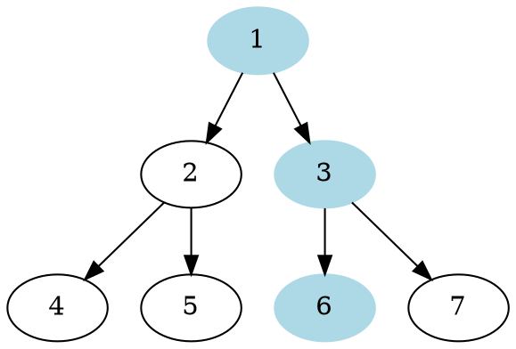

```plaintext
S: 10
Output: true
Explanation: The path with sum '10' is highlighted
```

Example 2:

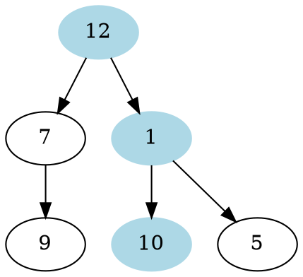

```plaintext
S: 23
Output: true
Explanation: The path with sum '23' is highlighted

S: 16
Output: false
Explanation: There is no root-to-leaf path with sum '16'
```

## Discussion

As we are trying to search for a root-to-leaf path, we can use the Depth First Search (DFS) technique to solve this problem.

To recursively traverse a binary tree in a DFS fashion, we can start from the root and at every step, make two recursive calls one for the left and one for the right child.

Here are the steps for our Binary Tree Path Sum problem:

1. Start DFS with the root of the tree.
2. If the current node is not a leaf node, do two things:
   1. Subtract the value of the current node from the given number to get a new sum => `S = S - node.value`.
   2. Make two recursive calls for both the children of the current node with the new number calculated in the previous step.
3. At every step, see if the current node being visited is a leaf node and if its value is equal to the given number ‘S’. If both these conditions are true, we have found the required root-to-leaf path, therefore return `true`.
4. If the current node is a leaf but its value is not equal to the given number ‘S’, return `false`.

Let’s take the example-2 mentioned above to visually see our algorithm:

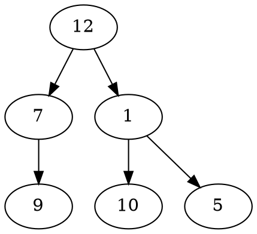

```plaintext
1 of 10
S: 23
Let's start with the root node
```

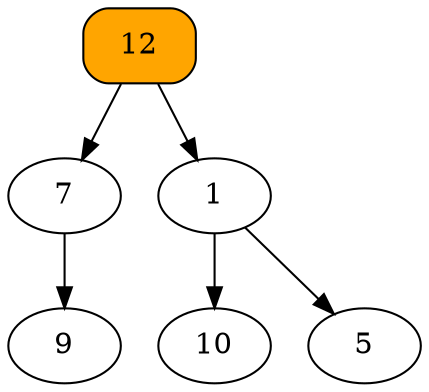

```plaintext
2 of 10
S: 23
Not a leaf node, make recursive calls for children.
```

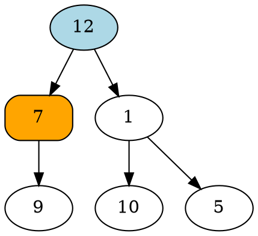

```plaintext
3 of 10
S: 11
Not a leaf node, make recursive call for the left child.
```

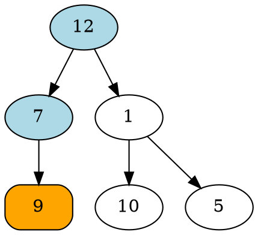

```plaintext
4 of 10
S: 4
Leaf node, but S != 9, therefore return false.
```

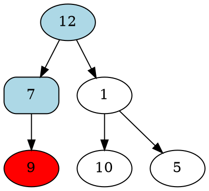

```plaintext
5 of 10
S: 11
After traversing the left-child, make a recursive call for the right child.
This recursive all will return false, as the right child is 'null'.
```

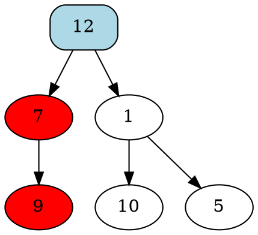

```plaintext
6 of 10
S: 23
After traversing the left-child, make a recursive call for the right child,
as the left-child failed in finding the path.
```

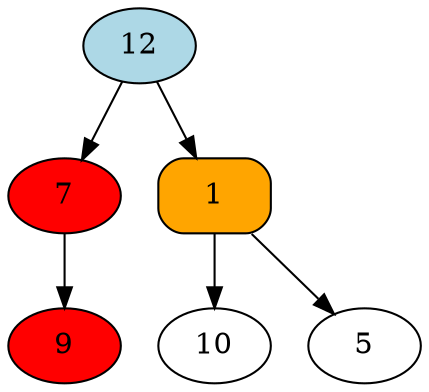

```plaintext
7 of 10
S: 11
Not a leaf node, make recursive call for the left child.
```

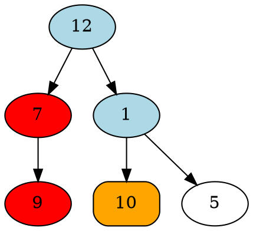

```plaintext
8 of 10
S: 10
Leaf node, but S == 10, we have found a path; therefore return true.
```

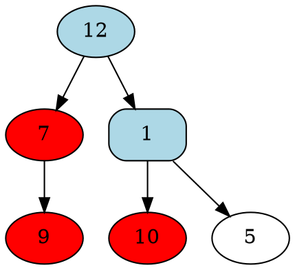

```plaintext
9 of 10
S: 11
As the left-child returned 'true', return 'true' without processing further.
```

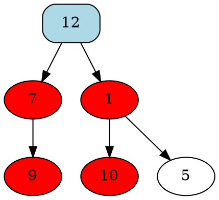

```plaintext
10 of 10
S: 23
As the right-child returned 'true', return 'true', we have found the path.
```

### Time Complexity

### Space Complexity

## Notes

## References
