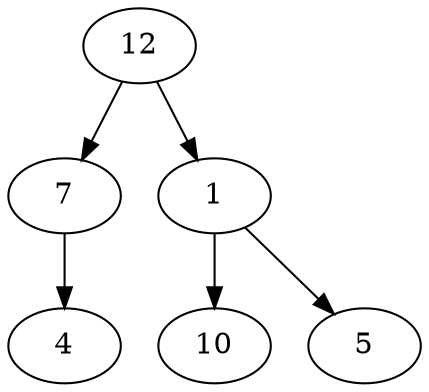

# Problem Definition

## Description

Given a binary tree, return all root-to-leaf paths.



```plaintext
12, 7, 4
12, 1, 10
12, 1, 5
```

## Discussion

We can follow a similar approach as in the **All Paths for a Sum** problem. We just need to remove the “check for the path sum”.

### Time Complexity

### Space Complexity

## Notes

## References
