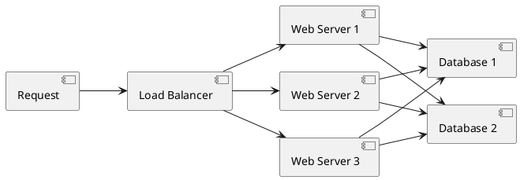
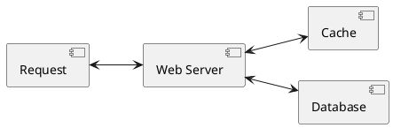
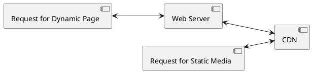
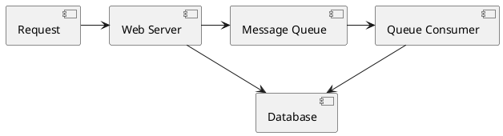
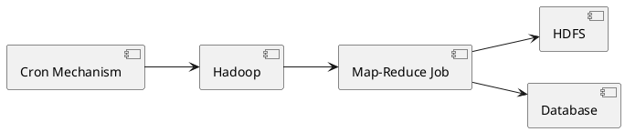
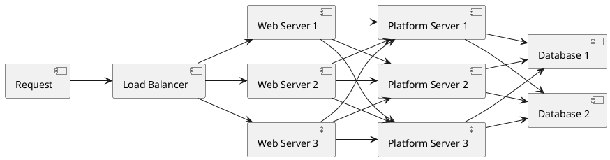

# Introduction to architecting systems for scale

- [Introduction to architecting systems for scale](#introduction-to-architecting-systems-for-scale)
  - [Load balancing](#load-balancing)
    - [Smart clients](#smart-clients)
    - [Hardware load balancers](#hardware-load-balancers)
    - [Software load balancers](#software-load-balancers)
  - [Caching](#caching)
    - [Application vs. database caching](#application-vs-database-caching)
    - [In-memory caches](#in-memory-caches)
    - [Content distribution networks](#content-distribution-networks)
    - [Cache invalidation](#cache-invalidation)
  - [Off-line processing](#off-line-processing)
    - [Message queues](#message-queues)
    - [Scheduling periodic tasks](#scheduling-periodic-tasks)
    - [Map-reduce](#map-reduce)
  - [Platform layer](#platform-layer)
  - [Other](#other)
  - [References](#references)

Color Convention

- _green_ is an external request from an external client (an HTTP request from a browser, etc),
- _blue_ is your code running in some container (a Django app running on [mod_wsgi](https://github.com/GrahamDumpleton/mod_wsgi), a Python script listening to [RabbitMQ](http://www.rabbitmq.com/), etc), and
- _red_ is a piece of infrastructure (MySQL, [Redis](http://redis.io/), RabbitMQ, etc).

## Load balancing

Both horizontal scalability and redundancy are usually achieved via load balancing.



- Load balancing is the process of spreading requests across multiple resources according to some metric (random, round-robin, random with weighting for machine capacity, etc) and their current status (available for requests, not responding, elevated error rate, etc).
- Load needs to be balanced between user requests and your web servers, but must also be balanced at every stage to achieve full scalability and redundancy for your system. A moderately large system may balance load at three layers:

  - user to your web servers,
  - web servers to an internal platform layer,
  - internal platform layer to your database.

There are a number of ways to implement load balancing.

### Smart clients

It is a client which takes a pool of service hosts and balances load across them, detects downed hosts and avoids sending requests their way (they also have to detect recovered hosts, deal with adding new hosts, etc, making them fun to get working decently and a terror to setup).

### Hardware load balancers

- Dedicated hardware load balancer (something like a Citrix NetScaler).
- Most expensive.
- Very high performance.
- "non-trivial" to configure.
- Mostly used only as the first point of contact from user requests to infrastructure, and use other mechanisms (smart clients or the hybrid approach) for load-balancing for traffic within their network.

### Software load balancers

- [HAProxy](http://www.haproxy.org/) is a great example of this approach.
- It runs locally on each of your boxes, and each service you want to load-balance has a locally bound port.
- For example, you might have your platform machines accessible via `localhost:9000`, your database read-pool at `localhost:9001` and your database write-pool at `localhost:9002`.
- HAProxy manages health checks and will remove and return machines to those pools according to your configuration, as well as balancing across all the machines in those pools as well.
- Recommended to start with a software load balancer and moving to smart clients or hardware load balancing only with deliberate need.

## Caching

Caching consists of:

- precalculating results (e.g. the number of visits from each referring domain for the previous day)
- pre-generating expensive indexes (e.g. suggested stories based on a user's click history), and
- storing copies of frequently accessed data in a faster backend (e.g. [Memcache](http://memcached.org/) instead of [PostgreSQL](http://www.postgresql.org/).
- In practice, caching is important earlier in the development process than load-balancing, and starting with a consistent caching strategy will save you time later on.
  - It also ensures you don't optimize access patterns which can't be replicated with your caching mechanism or access patterns where performance becomes unimportant after the addition of caching.
  - Many heavily optimized [Cassandra](http://cassandra.apache.org/) applications are a challenge to cleanly add caching to if/when the database's caching strategy can't be applied to your access patterns, as the datamodel is generally inconsistent between the Cassandra and your cache.

### Application vs. database caching



Application caching requires explicit integration in the application code itself. Usually it will check if a value is in the cache; if not, retrieve the value from the database; then write that value into the cache (this value is especially common if you are using a cache which observes the [least recently used caching algorithm](http://en.wikipedia.org/wiki/Cache_algorithms#Least_Recently_Used)).

The code typically looks like (specifically this is a read-through cache, as it reads the value from the database into the cache if it is missing from the cache):

```python
key = "user.%s" % user_id
user_blob = memcache.get(key)
if user_blob is None:
    user = mysql.query("SELECT * FROM users WHERE user_id=\"%s\"", user_id)
    if user:
        memcache.set(key, json.dumps(user))
    return user
else:
    return json.loads(user_blob)
```

The other side of the coin is database caching.


- Database's default settings provides some caching, which can be further optimized by configuration for specific access patterns.

### In-memory caches

- The most potent – in terms of raw performance – caches you'll encounter are those which store their entire set of data in memory.
- [Memcached](http://memcached.org/) and [Redis](http://redis.io/) are both examples of in-memory caches (caveat: Redis can be configured to store some data to disk). This is because accesses to RAM are [orders of magnitude](http://en.wikipedia.org/wiki/RAM_disk) faster than those to disk.
- On the other hand, you'll generally have far less RAM available than disk space, so you'll need a strategy for only keeping the hot subset of your data in your memory cache. The most straightforward strategy is [least recently used](http://en.wikipedia.org/wiki/Cache_algorithms#Least_Recently_Used), and is employed by Memcache (and Redis as of 2.2 can be configured to employ it as well).
- LRU works by evicting less commonly used data in preference of more frequently used data, and is almost always an appropriate caching strategy.

### Content distribution networks

- Useful for sites serving large amounts of static media.



- CDNs take the burden of serving static media off of your application servers (which are typically optimized for serving dynamic pages rather than static media), and provide geographic distribution.
- Overall, your static assets will load more quickly and with less strain on your servers (but a new strain of business expense).
- In a typical CDN setup, a request will first ask your CDN for a piece of static media
  - The CDN will serve that content if it has it locally available (HTTP headers are used for configuring how the CDN caches a given piece of content).
  - If it isn't available, the CDN will query your servers for the file and then cache it locally and serve it to the requesting user (in this configuration they are acting as a read-through cache).
- If your site isn't yet large enough to merit its own CDN, you can ease a future transition by serving your static media off a separate subdomain (e.g. `static.example.com`) using a lightweight HTTP server like [Nginx](http://nginx.org/), and cut-over the DNS from your servers to a CDN at a later date.

### Cache invalidation

- Caching require you to maintain consistency between your caches and the source of truth (i.e. your database), at risk of truly bizarre application behavior. Solving this problem is known as _cache invalidation_.

Each time a value changes, write the new value into the cache (this is called a write-through cache) or simply delete the current value from the cache and allow a read-through cache to populate it later (choosing between read and write through caches depends on your application's details, but generally I prefer write-through caches as they reduce likelihood of a stampede on your backend database).

Invalidation becomes meaningfully more challenging for scenarios involving fuzzy queries (e.g if you are trying to add application level caching in-front of a full-text search engine like [SOLR](http://lucene.apache.org/solr/)), or modifications to unknown number of elements (e.g. deleting all objects created more than a week ago).

In those scenarios you have to consider relying fully on database caching, adding aggressive expirations to the cached data, or reworking your application's logic to avoid the issue (e.g. instead of `DELETE FROM a WHERE...`, retrieve all the items which match the criteria, invalidate the corresponding cache rows and then delete the rows by their primary key explicitly).

## Off-line processing

With increasing complexity, it is almost always necessary to perform processing which can't be performed in-line with a client's request either because

- it creates unacceptable latency (e.g. you want to want to propagate a user's action across a social graph) or
- it needs to occur periodically (e.g. want to create daily rollups of analytics).

### Message queues

- For processing you'd like to perform inline with a request but is too slow, the easiest solution is to create a message queue (for example, [RabbitMQ](http://www.rabbitmq.com/)).
- Message queues allow your web applications to quickly publish messages to the queue, and have other consumers processes perform the processing outside the scope and timeline of the client request.

Dividing work between off-line work handled by a consumer and in-line work done by the web application depends entirely on the interface you are exposing to your users. Generally you'll either:

1. perform almost no work in the consumer (merely scheduling a task) and inform your user that the task will occur offline, usually with a polling mechanism to update the interface once the task is complete (for example, provisioning a new VM on Slicehost follows this pattern), or
2. perform enough work in-line to make it appear to the user that the task has completed, and tie up hanging ends afterwards (posting a message on Twitter or Facebook likely follow this pattern by updating the tweet/message in your timeline but updating your followers' timelines out of band; it's simple isn't feasible to update all the followers for a [Scobleizer](http://twitter.com/#!/scobleizer) in real-time).



Message queues have another benefit, which is that they allow you to create a separate machine pool for performing off-line processing rather than burdening your web application servers. This allows you to target increases in resources to your current performance or throughput bottleneck rather than uniformly increasing resources across the bottleneck and non-bottleneck systems.

### Scheduling periodic tasks

- Almost all large systems require daily or hourly tasks, but unfortunately this seems to still be a problem waiting for a widely accepted solution which easily supports redundancy.
- One solution is using [cron](http://en.wikipedia.org/wiki/Cron), but you could use the cronjobs to publish messages to a consumer, which would mean that the cron machine is only responsible for scheduling rather than needing to perform all the processing.
- Other options include:
  - homebrew systems, but not that clean and reusable.
  - storing the cronjobs in a Puppet config for a machine, which makes recovering from losing that machine easy, but it would still require a manual recovery, which is likely acceptable but not perfect.

### Map-reduce

If your large scale application is dealing with a large quantity of data, at some point you're likely to add support for [map-reduce](http://en.wikipedia.org/wiki/MapReduce), probably using [Hadoop](http://hadoop.apache.org/), and maybe [Hive](http://hive.apache.org/) or [HBase](http://hbase.apache.org/).



Adding a map-reduce layer makes it possible to perform data and/or processing intensive operations in a reasonable amount of time. You might use it for calculating suggested users in a social graph, or for generating analytics reports.

For sufficiently small systems you can often get away with adhoc queries on a SQL database, but that approach may not scale up trivially once the quantity of data stored or write-load requires sharding your database, and will usually require dedicated slaves for the purpose of performing these queries (at which point, maybe you'd rather use a system designed for analyzing large quantities of data, rather than fighting your database).

## Platform layer

Most applications start out with a web application communicating directly with a database. This approach tends to be sufficient for most applications, but there are some compelling reasons for adding a platform layer, such that your web applications communicate with a platform layer which in turn communicates with your databases.



- First, separating the platform and web application allow you to scale the pieces independently. If you add a new API, you can add platform servers without adding unnecessary capacity for your web application tier. (Generally, specializing your servers' role opens up an additional level of configuration optimization which isn't available for general purpose machines; your database machine will usually have a high I/O load and will benefit from a solid-state drive, but your well-configured application server probably isn't reading from disk at all during normal operation, but might benefit from more CPU.)
- Second, adding a platform layer can be a way to reuse your infrastructure for multiple products or interfaces (a web application, an API, an iPhone app, etc) without writing too much redundant boilerplate code for dealing with caches, databases, etc.
- Third, a sometimes underappreciated aspect of platform layers is that they make it easier to scale an organization. At their best, a platform exposes a crisp product-agnostic interface which masks implementation details. If done well, this allows multiple independent teams to develop utilizing the platform's capabilities, as well as another team implementing/optimizing the platform itself.

## Other

When handling multiple data-centers, cache invalidation and data replication/consistency become rather interesting problems.

## References

- [Introduction to architecting systems for scale](https://lethain.com/introduction-to-architecting-systems-for-scale/)
