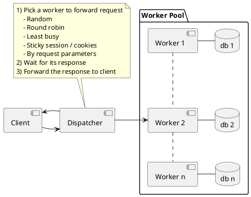
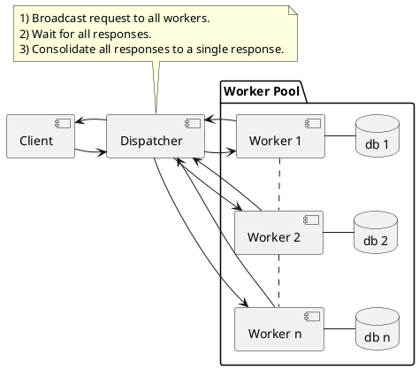
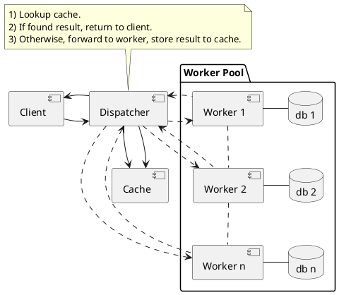

# Scalable System Design Patterns

- [Scalable System Design Patterns](#scalable-system-design-patterns)
  - [Load Balancer](#load-balancer)
  - [Scatter and Gather](#scatter-and-gather)
  - [Result Cache](#result-cache)
  - [Shared Space](#shared-space)
  - [Pipe and Filter](#pipe-and-filter)
  - [Map Reduce](#map-reduce)
  - [References](#references)

## Load Balancer

- There is a dispatcher that determines which worker instance will handle the request based on different policies.
- The application should best be "stateless" so any worker instance can handle the request.
- This pattern is deployed in almost every medium to large web site setup.



## Scatter and Gather

- The dispatcher multi-casts the request to all workers of the pool.
- Each worker will compute a local result and send it back to the dispatcher, who will consolidate them into a single response and then send back to the client.
- This pattern is used in Search engines like Google to handle user's keyword search request, etc.



## Result Cache

- The dispatcher will first lookup if the request has been made before and try to find the previous result to return, in order to save the actual execution.
- This pattern is commonly used in large enterprise application.
- Memcached is a very commonly deployed cache server.



## Shared Space

- Also known as "Blackboard".
- All workers monitors information from the shared space and contributes partial knowledge back to the blackboard.
- The information is continuously enriched until a solution is reached.
- This pattern is used in JavaSpace and also commercial product GigaSpace.

```plantuml
@startuml
note top of Client
1) Put request in space.
2) Take request from space.
end note
cloud "Tuple Space"
[Client] -> [Tuple Space]
package "Worker Pool 1" {
    [Worker n]
    [Worker 2]
    [Worker 1]
}
package "Worker Pool 2" {
    [Worker m]
    [Worker 5]
    [Worker 4]
}
note as WorkerPoolNote
Repeat
1) Take intermediate result from space.
2) Add value to result.
3) Put partial result in space.
end note
[Worker n] .. WorkerPoolNote
WorkerPoolNote .. [Worker m]
[Worker n] --> [Tuple Space]
[Worker n] <-- [Tuple Space]
[Worker 1] --> [Tuple Space]
[Worker 1] <-- [Tuple Space]
[Worker 2] --> [Tuple Space]
[Worker 2] <-- [Tuple Space]
[Tuple Space] --> [Worker m]
[Tuple Space] <-- [Worker m]
[Tuple Space] --> [Worker 4]
[Tuple Space] <-- [Worker 4]
[Tuple Space] --> [Worker 5]
[Tuple Space] <-- [Worker 5]
@enduml
```

## Pipe and Filter

- This model is also known as "Data Flow Programming"; all workers connected by pipes where data is flow across.
- [This pattern](http://www.eaipatterns.com/PipesAndFilters.html) is a very common EAI pattern.

```plantuml
@startuml
note top of Client
1) Put command in request queue.
2) Take result from response queue.
end note
component "Intermediate Queue"
[Client] -> [Request Queue 1]
[Client] -> [Request Queue 2]
package "Worker Pool 1" {
    [Worker n]
    [Worker 2]
    [Worker 1]
}
[Request Queue 1] -> [Worker 1]
[Request Queue 1] -> [Worker 2]
[Request Queue 1] -> [Worker n]
package "Worker Pool 2" {
    [Worker m]
    [Worker 5]
    [Worker 4]
}
[Request Queue 2] -> [Worker 4]
[Request Queue 2] -> [Worker 5]
[Request Queue 2] -> [Worker m]
note as WorkerPoolNote
Repeat
1) Take data from input queue.
2) Processing data.
3) Put processed data in output queue.
end note
[Worker n] .. WorkerPoolNote
WorkerPoolNote .. [Worker m]
[Worker n] --> [Intermediate Queue]
[Worker 1] --> [Intermediate Queue]
[Worker 2] --> [Intermediate Queue]
[Intermediate Queue] --> [Worker m]
[Intermediate Queue] --> [Worker 4]
[Intermediate Queue] --> [Worker 5]
@enduml
```

## Map Reduce

- The model is targeting batch jobs where disk I/O is the major bottleneck.
- It uses a distributed file system so that disk I/O can be done in parallel.
- This pattern is used in many of Google's internal application, as well as implemented in open source Hadoop parallel processing framework.
- This pattern can be used in many many application design scenarios.

## References

1. [Scalable System Design Patterns](http://horicky.blogspot.com/2010/10/scalable-system-design-patterns.html)
2. [Scalable System Design](http://horicky.blogspot.com/2008/02/scalable-system-design.html)
