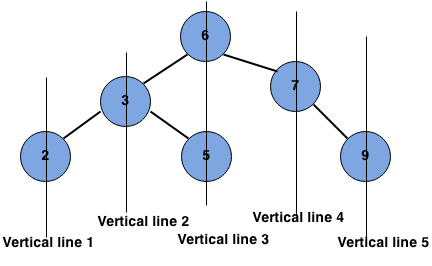

# Problem Definition

## Description

Given a binary tree, print a vertical order traversal of it.

Example :
Given binary tree:

```text
      6
    /   \
   3     7
  / \     \
 2   5     9
 ```

returns

```text

[
    [2],
    [3],
    [6 5],
    [7],
    [9]
]

```



**Note:** If 2 Tree Nodes shares the same vertical level then the one with lesser depth will come first.

## Notes

1. [Geeks for Geeks post](https://www.geeksforgeeks.org/print-binary-tree-vertical-order/)
1. [ProgramCreek post](https://www.programcreek.com/2014/04/leetcode-binary-tree-vertical-order-traversal-java/)
1. [YT - Vivekanand Khyade : Algorithm Every Day](https://www.youtube.com/watch?v=PQKkr036wRc)
1. [YT - Vivekanand Khyade : Algorithm Every Day - Level Order Traversal of a Binary Tree](https://www.youtube.com/watch?v=NjdOhYKjFrU)